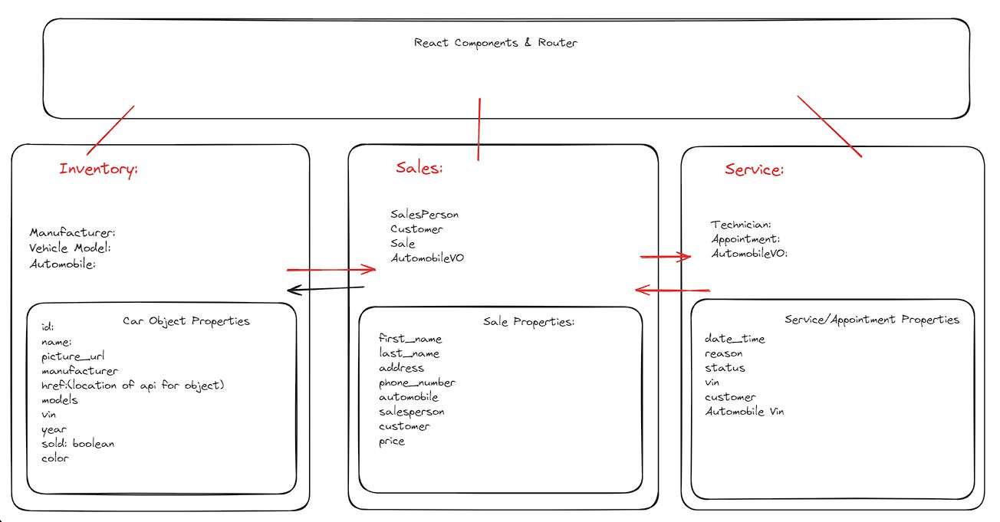

# CarCar -  

Team:

* Wayne - Inventory(api,Automobiles props) + Frontend(react) + Readme + Styling
* Vincent - Sales + Service + Backend

## Design

## Service microservice

The Service Microservice in this Django/React app is designed to manage and track service appointments for automobiles and their owners. It involves creating three key models: Technician, AutomobileVO, and Appointment. The Technician model stores technician details, the AutomobileVO model tracks automobile VINs and their sales status, and the Appointment model manages service appointment details. This microservice exposes several RESTful API endpoints for creating, listing, updating, and deleting technicians and appointments. The React frontend interacts with these endpoints to display data and handle user actions such as scheduling appointments and managing appointment statuses. A poller runs every 60 seconds to update the AutomobileVO model with the latest VINs from the Inventory service.

## Sales microservice

The Sales Microservice in this Django app is focused on handling sales-related operations. It provides API endpoints for managing sales transactions, customer orders, and generating sales reports. The React frontend uses these endpoints to fetch and display sales data dynamically. This microservice ensures that all sales data is accurately recorded and accessible for analysis and reporting, supporting a data-driven approach to managing automobile sales. Through seamless integration with the Service Microservice, it ensures that any sales-related information required for servicing is readily available, enabling a cohesive and efficient workflow across the application.

### Features & Maintainer

Features of the Assessment Project Site
Inventory Management
AutomobileVO Model: Tracks vehicle identification numbers (VINs) and their sales status.
Automobile Poller: Updates the AutomobileVO model every 60 seconds with new VINs from the Inventory service.
Sales Microservice
Manage Sales Transactions: Handles recording and processing sales transactions.
Customer Orders: Manages customer orders and payment processing.
Sales Reports: Generates and provides access to sales reports.
API Endpoints:
List sales transactions
Create a sales transaction
Update a sales transaction
Delete a sales transaction
Service Microservice
Technician Management:

Technician Model: Stores technician details including first name, last name, and employee ID.
API Endpoints:
List technicians
Create a technician
Delete a technician
Service Appointment Management:

Appointment Model: Manages details of service appointments, including date/time, reason, status, VIN, customer, and technician.
API Endpoints:
List appointments
Create an appointment
Delete an appointment
Set appointment status to "canceled"
Set appointment status to "finished"
Special Features:
VIP Appointments: Marks appointments as VIP if the VIN exists in the inventory.
Appointment Status: Allows appointments to be canceled or marked as finished without deletion.
Service History: Displays the history of all appointments and allows searching by VIN.
Front-End Development with React
Technician Features:

Add a Technician: Form to enter a technician's name and employee ID.
List All Technicians: Page displaying a list of all technicians with their employee IDs and names.
Service Appointment Features:

Create a Service Appointment: Form to schedule service appointments including VIN, customer name, date/time, assigned technician, and reason for service.
List All Service Appointments: Page showing scheduled appointments with details and VIP status.
Service History: Page to display all past appointments and allow searching by VIN. Displays status as "created", "canceled", or "finished".
Navigation:

Links in the navbar to access forms for adding technicians, creating service appointments, listing technicians, listing appointments, and viewing service history.

### CRUD Explanation

This assessment project is a CRUD (Create, Read, Update, Delete) app because it encompasses the fundamental operations needed to manage data within its various microservices. The Sales Microservice and Service Microservice both provide a range of API endpoints that allow for the creation, retrieval, updating, and deletion of records. For instance, the Service Microservice allows users to create new technicians and service appointments, list all existing technicians and appointments, update the status of appointments (to "canceled" or "finished"), and delete technicians and appointments. These operations demonstrate the core CRUD functionalities essential for managing and manipulating the application's data.

Additionally, the React frontend interacts with these CRUD APIs to offer a user-friendly interface for performing these operations. Users can fill out forms to add new technicians or schedule service appointments, view lists of existing technicians and appointments, update appointment statuses directly from the list view, and remove technicians or appointments as needed. This interaction between the frontend and backend to perform create, read, update, and delete operations is a hallmark of CRUD applications, ensuring that users can efficiently manage the application's data through a cohesive and intuitive interface.

### How to run!

# Assessment Project Setup Guide

## Prerequisites
- Ensure you have Docker and Docker Compose installed on your system.
- Ensure you have access to the code repository on GitLab.

## Step-by-Step Instructions

###  Clone the Repository
- Git Clone https://gitlab.com/Beckomw/project-beta
- Cd into base directory
- Run "Docker compose build"
- Run "Docker compose up"
- Enter link in browser and enjoy "http://localhost:5173/"

### Accessing the Admin pages - (you must be logged in)
Open a browser and navigate to the admin interfaces for each microservice:

Inventory: http://localhost:8100/admin/
Service: http://localhost:8080/admin/
Sales: http://localhost:8090/admin/

### API ENDPOINTS AND USE CASES 

### Manufacturers
- **List manufacturers**: `GET http://localhost:8100/api/manufacturers/`
- **Create a manufacturer**: `POST http://localhost:8100/api/manufacturers/`
- **Get a specific manufacturer**: `GET http://localhost:8100/api/manufacturers/:id/`
- **Update a specific manufacturer**: `PUT http://localhost:8100/api/manufacturers/:id/`
- **Delete a specific manufacturer**: `DELETE http://localhost:8100/api/manufacturers/:id/`

### Vehicle Models
- **List vehicle models**: `GET http://localhost:8100/api/models/`
- **Create a vehicle model**: `POST http://localhost:8100/api/models/`
- **Get a specific vehicle model**: `GET http://localhost:8100/api/models/:id/`
- **Update a specific vehicle model**: `PUT http://localhost:8100/api/models/:id/`
- **Delete a specific vehicle model**: `DELETE http://localhost:8100/api/models/:id/`

### Automobiles
- **List automobiles**: `GET http://localhost:8100/api/automobiles/`
- **Create an automobile**: `POST http://localhost:8100/api/automobiles/`
- **Get a specific automobile**: `GET http://localhost:8100/api/automobiles/:vin/`
- **Update a specific automobile**: `PUT http://localhost:8100/api/automobiles/:vin/`
- **Delete a specific automobile**: `DELETE http://localhost:8100/api/automobiles/:vin/`

### Technicians
- **List technicians**: `GET http://localhost:8080/api/technicians/`
- **Create a technician**: `POST http://localhost:8080/api/technicians/`
- **Delete a specific technician**: `DELETE http://localhost:8080/api/technicians/:id/`

### Appointments
- **List appointments**: `GET http://localhost:8080/api/appointments/`
- **Create an appointment**: `POST http://localhost:8080/api/appointments/`
- **Delete an appointment**: `DELETE http://localhost:8080/api/appointments/:id/`
- **Set appointment status to "canceled"**: `PUT http://localhost:8080/api/appointments/:id/cancel/`
- **Set appointment status to "finished"**: `PUT http://localhost:8080/api/appointments/:id/finish/`

### Salespeople
- **List salespeople**: `GET http://localhost:8090/api/salespeople/`
- **Create a salesperson**: `POST http://localhost:8090/api/salespeople/`
- **Delete a specific salesperson**: `DELETE http://localhost:8090/api/salespeople/:id/`

### Customers
- **List customers**: `GET http://localhost:8090/api/customers/`
- **Create a customer**: `POST http://localhost:8090/api/customers/`
- **Delete a specific customer**: `DELETE http://localhost:8090/api/customers/:id/`

### Sales
- **List sales**: `GET http://localhost:8090/api/sales/`
- **Create a sale**: `POST http://localhost:8090/api/sales/`
- **Delete a sale**: `DELETE http://localhost:8090/api/sales/:id/`
